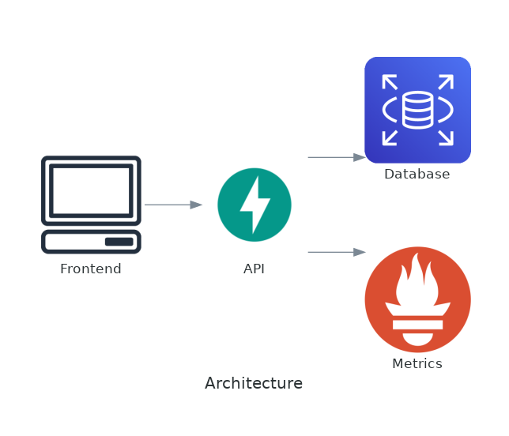

# cybersecurity-fiap

API responsible for the data used in the cybersecurity challenge sprint

[](https://www.python.org/downloads/release/python-3105/) 
[](https://www.python.org/dev/peps/pep-0020/) 
[](https://www.python.org/dev/peps/pep-0008/) 
[](https://github.com/PyCQA/bandit)
[](https://github.com/psf/black)

## Technology and Resources

- [Python 3.10](https://www.python.org/downloads/release/python-3105/) - **pre-requisite**
- [Docker](https://www.docker.com/get-started) - **pre-requisite**
- [Docker Compose](https://docs.docker.com/compose/) - **pre-requisite**
- [Pipenv](https://github.com/pypa/pipenv)
- [FastAPI](https://github.com/tiangolo/fastapi)
- [Uvicorn](https://github.com/encode/uvicorn)

*Please pay attention on **pre-requisites** resources that you must install/configure.*

## Architecture



### Updating diagram
This diagram is based on python's [Diagrams](https://diagrams.mingrammer.com/).

The source file is located at `.docs/diagrams/architecture.png` and `make local/generate-diagram` will render the new `.docs/diagrams/architecture.png` file.

### API Docs

#### Routes

- `/`: The root path is a redirect to `/docs`
- `/docs`: Swagger
- `/redoc`: Redoc
- `/health-check`: Verify sure the application is up

### How to Install

```
make local/install
```

### How to Build

```
make docker/build
```

### How to Run

```
make local/run
make docker/run
```

*The project will be running at `http://localhost:8000/`*

The `entrypoint` of this project is the `run.py` file on the root path.

### How to Test

```
make local/test
make docker/test
```

### How to lint

`make docker/lint` or `make local/lint` to lint

`make docker/bandit` or `make local/bandit` to execute the bandit check

`make docker/check-packages` or `make local/check-packages` to check for packages vulnerabilities

**Helpful commands**

*Please, check all available commands in the [Makefile](Makefile) for more information*.

## Extras infos

- If you use the [vscode](https://code.visualstudio.com/) editor we have some examples of [launch.json](.docs/vscode.md) to speed up your tests.

    *Note: When you run the install command (using docker or locally), a .env file will be created automatically based on [env.template](env.template)*
